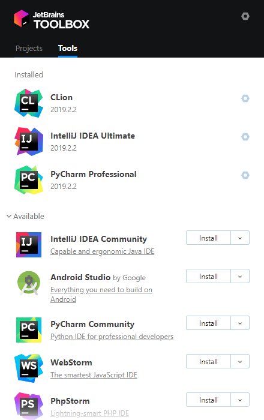
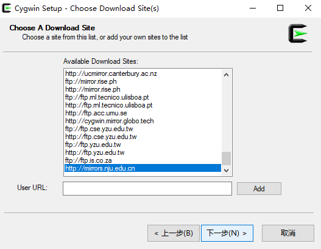
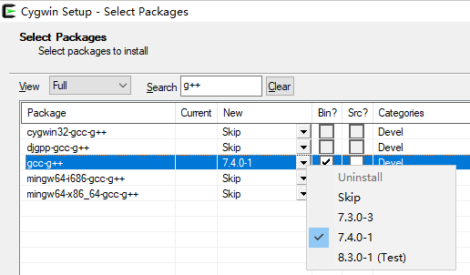
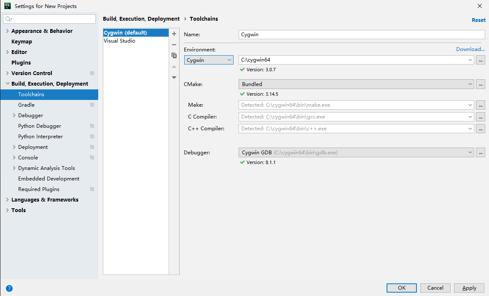
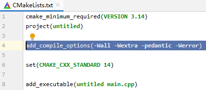

# [CLion](https://www.jetbrains.com/clion/)

CLion是[JetBrains](https://www.jetbrains.com/)系列IDE之一。他家的IDE都很优秀，除了CLion之外，还有[IntelliJ IDEA](https://www.jetbrains.com/idea/) (Java)、[PyCharm](https://www.jetbrains.com/pycharm) (Python)等等都是该语言首选IDE，且学生可免费使用所有专业版功能。

已经安装了Visual Studio是否还有必要安装CLion呢？
- 安装。CLion可以使用GCC、Clang等编译器。我们做OJ的系统，编译器使用的是GCC。VS默认编译器MSVC有很多与GCC不同的行为，以至于有的代码在VS上能运行却通不过OJ系统编译。
- 可以不安装，VS也可以使用Clang编译器，这个编译器符合C/C++相关语言标准，与GCC编译行为差异不大。一般而言，可以应对OJ系统。

我的建议是，**仍然建议安装CLion**，你可以自行比较二者的区别选择自己喜欢的。

下面开始介绍具体的安装和使用。

## 安装

 1. [填写信息](https://www.jetbrains.com/shop/eform/students)，激活学生账号。邮箱必须使用[南大邮箱](https://mail.smail.nju.edu.cn/)，账号是 "学号@smail.nju.edu.cn"，默认密码是身份证号。
 
 2. 下载[Toolbox App](https://www.jetbrains.com/toolbox/download/download-thanks.html)并安装，在Toolbox中安装CLion（如有其他IDE需要也可安装，选择Ultimate或Professional版）。不直接下载CLion是因为Toolbox App可以安装其他JetBrians的IDE，且能自动升级。<br>

 
 
## 配置

打开CLion进行一系列个性化设置后，进入Customize CLion窗口，这个窗口必须要配置正确才能正常使用（也可以后续在设置里配置）。
上一节安装VS比较简单，因为它将编译器等工具集成在一起。而CLion不含编译器等工具，因此配置时需要一些额外的步骤。配置过程因操作系统而异，图为Ubuntu系统的配置截图：<br>


### Windows
 1. 如果先安装了VS，那么配置页应该存在一个配置：<br>
 
 
 
 2. 但是，注意到有一行字 "Debugging is not yet supported with Visual Studio"，而调试（Debug）是找出程序bug很重要的手段，所以我们不使用这个配置。点击`+`创建新的配置，Environment下拉菜单有多种环境可以配置，我们使用[Cygwin](https://cygwin.com/index.html)。其他配置方法，比如[MinGW](http://mingw.org/)、[WSL](https://docs.microsoft.com/en-us/windows/wsl/install-win10)请见[这个链接](https://www.jetbrains.com/help/clion/quick-tutorial-on-configuring-clion-on-windows.html)。
 
 3. Cygwin提供了大量的[POSIX API](https://en.wikipedia.org/wiki/POSIX)，并移植了大量的开源工具，使得在Windows系统可以运行Linux程序，包括GCC。
 
 4. 首先，[下载Cygwin x86_64](https://cygwin.com/setup-x86_64.exe)（或 [x86版](https://cygwin.com/setup-x86.exe)）。
 
 5. 一直点下一步，直到Choose A Download Site，User URL中输入 `http://mirrors.nju.edu.cn/cygwin` 点击add。<br>
 
 
 
 6. 选择要安装的包，至少需要安装四个加粗的包，wget可以用来安装apt-cyg（见8.），在搜索框输入后找到名称完全相同的，选择不是test的最新版本：
	- **gcc-g++**
	- **make**
	- **cmake**
	- **gdb**
	- wget<br>

 

 7. 勾选了必需的四个包且安装完毕后，回到CLion，添加一个Cygwin配置，大功告成！<br>
 
 
 
 8. Cygwin如果安装了wget，可以很方便地安装apt-cyg，这是一个包管理程序。打开cygwin，在命令行中输入下面两行命令。
 
    ```bash
    wget rawgit.com/transcode-open/apt-cyg/master/apt-cyg
    install apt-cyg /bin
    ```

    - 用apt-cyg可以方便地安装更多的工具，比如输入`apt-cyg install sl`，然后输入`sl`命令试试？
    - 一些常用的工具也可以装上，比如 [git](https://git-scm.com/) 和 [vim](https://www.vim.org/)：`apt-cyg install git vim`。感兴趣可以搜资料学习，会很有帮助。

### Linux
CLion依赖于一些软件包，执行下面的命令安装需要的软件包即可：
 - Ubuntu: `sudo apt install build-essential` 
 - CentOS/RHEL/Fedora: `yum groupinstall "Development Tools"`

### Mac OS
没有用过Mac，请按照这个[教程](https://www.jetbrains.com/help/clion/quick-tutorial-on-configuring-clion-on-macos.html)进行配置，应该比Windows安装过程简单。

## 激活
使用注册了学生版的邮箱登录即可激活。<br>


## 运行第一个程序

 1. 点击New Project创建项目<br>
 
 
 
 2. 打开CMakeLists.txt，添加一行代码。作用是将警告转为错误，这样你就不得不消除所有警告，这更利于编写出正确的程序。

 ```cmake
 add_compile_options(-Wall -Wextra -pedantic -Werror)
 ```

 <br>

 3.  CLion为我们写好了main.cpp，点击右上角的运行

 <br>

 4. 修改代码如下，重新运行，你发现了什么？

    ```cpp
    #include <iostream>
    using namespace std;
    
    int main() {
        bool cpp_is_simple = false;
        if (cpp_is_simple = true)
            cout << "Hello, World!" << endl;
        else
            cout << "Goodbye, World!" << endl;
        return 0;
    }
    ```

 5. 去掉`add_compile_options(-Wall -Wextra -pedantic -Werror)`再次重新运行，有什么不同？

 6. 上面两个问题对没有接触过C++的同学可能比较难。简单解释一下，第6行`if (cpp_is_simple = true)`语法上是正确的，但这样用几乎都是错的。通常编写者想写`if (cpp_is_simple == true)`，由于疏忽少写了一个`=`，这种错误有时候非常难以发现。但编译时编译器是知道的，默认情况下只给你一条警告甚至警告也没有，我们加了`-Wall -Wextra -pedantic`让编译器尽可能警告不符合规范的代码，`-Wextra`将警告视为错误，这种小bug就插翅难飞了。
