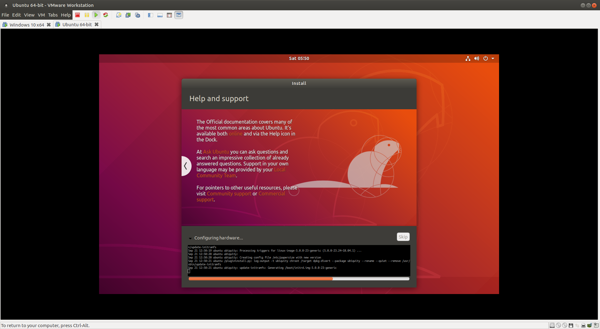
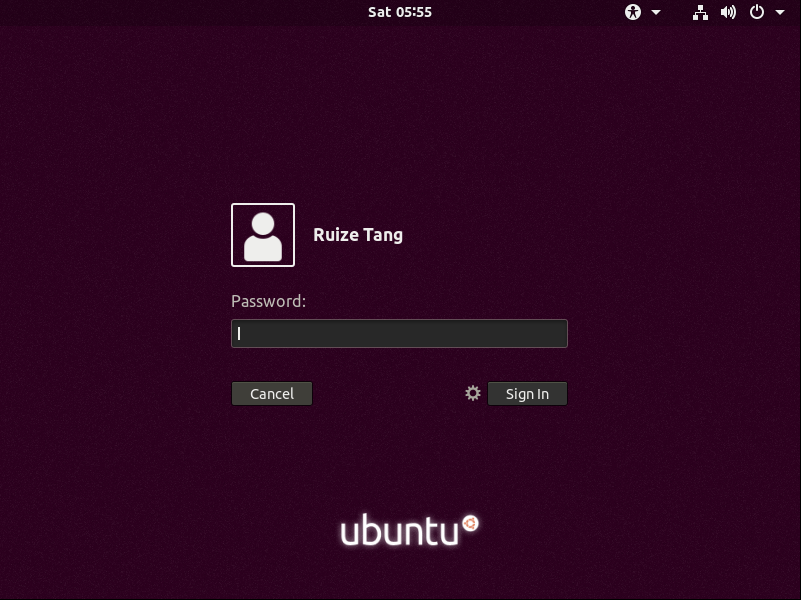

# Ubuntu虚拟机
*本节不是必要的，且描述比较简单，有兴趣的同学的可以尝试。*

前面已经提到了多次Linux的概念，你可能也注意到Windows配置环境非常麻烦，而Linux需要简单的几条指令就能完成。在后面众多的课程中，Linux也是会常常使用到。不妨试试真正的Linux？

## 虚拟机
> "An efficient, isolated duplicate of a real computer machine."  --[Popek and Goldberg](https://en.wikipedia.org/wiki/Popek_and_Goldberg_virtualization_requirements) 

不严格的说，虚拟机就是采用虚拟化技术，虚拟地提供物理机的功能。我们这里的虚拟机是系统虚拟机，在Windows系统运行了另一个操作系统。

常见的虚拟机程序有 [VMWare](https://www.vmware.com/)，[VirtualBox](https://www.virtualbox.org/)。VMWare是商业软件，如果你有授权的话建议使用（[Windows下载链接](https://www.vmware.com/go/getworkstation-win)）。VirtualBox是免费且开源的软件（[下载链接](https://www.virtualbox.org/wiki/Downloads)）。

## Ubuntu 18.04
我们以VMWare为例，安装一个Ubuntu 18.04虚拟机。

Ubuntu是一种Linux发行版，可以使用学校的镜像源[下载](http://mirrors.nju.edu.cn/ubuntu-releases/18.04.3/ubuntu-18.04.3-desktop-amd64.iso)。[Linux发行版](https://www.distrowatch.com/)众多，你也可以尝试并挑选你喜欢的。

安装步骤： 

后面全部点Next，等待虚拟机配置完成。

# 扩展阅读
这里有个[Linux入门](https://nju-ics.gitbooks.io/ics2018-programming-assignment/content/linux.html)教程。

Windows虚拟化技术技术也十分成熟，你可以尝试自己安装[WSL2](https://docs.microsoft.com/en-us/windows/wsl/wsl2-install)。

[Docker](https://www.docker.com/)是现在很流行的虚拟化容器，你可以上网搜索更多资料并安装。
