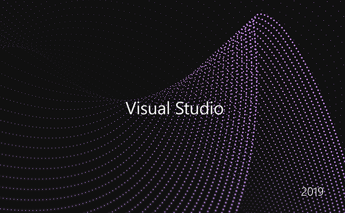
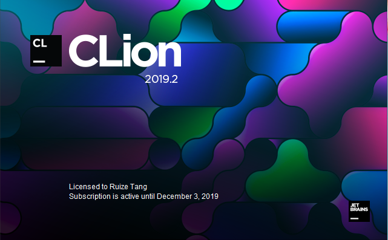

# 开发环境搭建

工欲善其事必先利其器，在正式开始学习C/C++语言之前，我们先对开发环境进行配置。本章将介绍两种[集成开发环境（IDE）](https://en.wikipedia.org/wiki/Integrated_development_environment)，两种都推荐安装，选择其中任意一种都可以进行后续的代码编写。如果你对这方面内容熟悉，可以跳过本章节。

**强烈不推荐：~~Dev-C++~~、~~VC 6.0~~**，已经过时太久，计算机软件更新换代很快，使用这些IDE可能会出现与预期结果不符等情况，不利于编写出正确的程序。

## [Microsoft Visual Studio](0.0.Microsoft_Visual_Studio.md)

## [CLion](0.1.CLion.md)

# 扩展阅读
你一定能猜到上面说的集成开发环境是一种能将 **纯文本的代码** 生成 **可执行程序** 的软件，实际上这涉及到两个过程：[**编译** 和 **链接**](https://www.cprogramming.com/compilingandlinking.html)，这两个过程分别由单独的程序提供，而集成开发环境将这些工具整合起来，辅助代码开发人员进行代码编写和管理，比如代码不全、错误提醒等等。

也就是说，集成开发环境并不是编写代码必要的，很多人喜欢直接用文本编辑器编写代码（当你熟悉之后也许也会喜欢用文本编辑器的），比如被誉为编辑器之神的[VIM](https://www.vim.org/)和神的编辑器[Emacs](https://www.gnu.org/software/emacs/)。

编写好代码后，通过编译链接就可以得到可执行程序了，这个过程由编译器和链接器完成。常用的编译器有：[GCC](https://gcc.gnu.org/)、[Clang](https://clang.llvm.org/)，编写简单的代码时，编译器通常把两个步骤一起做了。对编译器和链接器感兴趣可以自己搜索资料。

下面是一个在Linux平台使用GCC编译一个程序的例子（`#`后面是注释）： 

如果对Linux系统感兴趣，可以尝试[装一个Ubuntu虚拟机](0.2.Ubuntu虚拟机.md)。