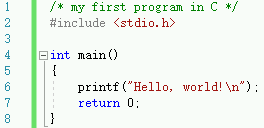

# 一个程序的结构

> The best way to learn a programming language is by writing programs.

最好的学习编程语言的方式就是用它来写程序。现在打开你的IDE，编写下面的代码（专门用的图片防止复制）： 

这个代码非常简单，只是打印出 `Hello, world!`。麻雀虽小五脏俱全，它包含了一个C语言代码的所有基本要素。下面我们来一行一行解读这个代码。

## 第1行：`/* my first program in C */`
从代码高亮和文字本身不难猜出，这是一行注释。以`/*`开头，`*/`结尾，中间是注释内容，可以跨越多行。

注释对程序来说没有什么用，预处理时就被编译器去掉了。但是有注释的代码让人更容易理解。

当你在做一个很大的项目时，要是不写注释，回过头来不知道自己写的什么东西了，可能会很麻烦。要是团队合作项目，别人看了你的代码都想打人。要是你写了一个有意思的程序，想跟大家~~炫耀~~分享，然而代码风格太差不好意思发出来~_~。所以编程时一定要写上必要的注释。

[C99标准](http://www.iso-9899.info/wiki/The_Standard)的C语言开始支持C++风格的注释，这是一种单行注释，以`//`开头，该行后面的内容就是注释内容。这行注释可以改写为 `// my first program in C`。

扩展阅读：
- 要是写代码时就有很好的代码风格，那么后面写说明文档都可以省了，有兴趣可以了解 [Doxygen](http://doxygen.nl/)。
- 尝试将这行注释改为C++风格的，然后使用C89标准进行编译，GCC命令为：`gcc -std=c89 main.c`，你发现了什么？当然，现在你不太可能会使用C89标准来写代码，但如果对各个标准感兴趣可以上网搜索。

## 第2行：`#include <stdio.h>`
以`#`开头的行同样是被编译器预处理的，`#`后面接了一条预处理指令，这里的`include`就是告诉编译器把后面的`stdio.h`这个文件包含进来。

在C语言里，后缀为`.h`的文件被称为头文件，`stdio.h`中的stdio是 **St**an**d**ard **I**nput/**O**utput 的缩写。它声明了大量标准的输入输出函数，有了它，编译器就知道了printf从哪里来的。

注意到`<stdio.h>`两边有尖括号。`include`指令有两种形式，一种是这种尖括号，另一种是双引号，比如`#include "stdio.h"`。两种编译器都能找到相应文件，我们应该使用尖括号来包含标准库的头文件，自己写的头文件用双引号。对于尖括号，编译器会优先搜索标准库路径，双引号优先搜索你的项目路径。

扩展阅读：
- 前面说的`include`是将头文件包含进来，"包含"是什么意思呢？原理上就是字面意义的把文件内容插入到被包含的位置。所以后面被包含的文件可以不是头文件，你甚至可以包含`.c`、`.txt`文件。但是你只应该包含`.h`头文件，这是规范的编程风格。
- `stdio.h`既然是个文件，它到底在哪里呢？Linux系统试试`locate stdio.h`，Windows系统在`Windows Kits`目录搜一搜。VS和CLion都支持按住Ctrl点击头文件，会自动跳转到头文件。
- 把这行注释掉，再点击运行会发生什么？

## 第3行
空白行，增加代码可读性，没有其他效果。

## 第4行： `int main()`
定义了一个名叫`main`的函数，本质上讲，函数就是一组表达式组成的在一起起了个名字。这一行声明了这个函数的形式，之后的章节再详细介绍。声明一个函数必须要有三个部分，以这个函数为例，返回值类型：`int`，函数名称`main`，可以为空的参数列表`()`。现在只要记住`main`函数的声明是`int main()`就好了。

`main`函数是一个特殊的函数，它为程序指明了从什么地方开始执行，是程序的入口。每个程序都必须有且只能有一个`main`函数。

扩展阅读：
- VS的MSVC编译器允许`void main()`来声明`main`函数，但这是非常不好的代码规范，标准的C语言不允许这样写。因为`main`是程序入口，那么`main`执行完程序就结束了。我们怎么知道程序执行结果呢？这就需要一个`int`类型的返回值来告诉用户，而`void`就是没有返回值。由于不符合标准，如果用来做OJ就无法通过编译了。还好Clang就真的很严格呢，在VS上写`void main()`并去掉第7行，然后分别用MSVC和Clang编译试试？
- 声明的第三部分`()`，其参数列表是空的。`main`函数的参数列表可以不为空，感兴趣可以阅读这个[链接](https://stackoverflow.com/questions/3898021/regarding-mainint-argc-char-argv)。

## 第5行和第8行：`{ ... }`
大括号之间构成了代码块，表示是`main`函数的主体部分。

扩展阅读：
- 有的人喜欢把`{`写到`int main()`同一行（[1TBS](https://en.wikipedia.org/wiki/Indentation_style#Variant:_1TBS_(OTBS))），有的人喜欢单独用一行（[K&R style](https://en.wikipedia.org/wiki/Indentation_style#K&R_style)），这就形成了不同的coding style。忠告：不要试图说服另一个程序员用你喜欢的风格。

## 第6行：`printf("Hello, world!\n");`
这是一行C语言表达式，它是实际产生效果的语句，由三部分构成：
1. 被调用函数名称`printf`，这个函数将参数格式化打印到标准输出（一般是"黑框框"里）。
2. 参数列表，此处只有一个参数`"Hello, world!\n"`。注意`\n`是换行符，是一个[转义字符](https://en.wikipedia.org/wiki/Escape_sequences_in_C)。
3. 分号`;`结尾。

## 第7行：`return 0;`
也是一行表达式，`return`是C语言的一个[关键词](https://en.wikipedia.org/wiki/C_%28programming_language%29#Reserved_words)，它是被预先定义，不能用于其他用途（比如用作函数名）。执行到`return`语句时，如果下面还有语句，将不会继续执行，而在`return`处返回。后面跟一个返回值要与函数声明的匹配（`main`返回值声明为`int`）。

扩展阅读：
- 对于`main`函数的返回值，一般`0`表示正常结束，非`0`表示异常结束。
- `main`可以省略这条语句，表示返回0。但是其他有返回值的函数都不能省略`return`语句。可以删掉编译一下。

# 结语
没想到吧！这么个简单的程序，竟然还有点东西。其实还省略了好多，以后再慢慢讲了。通过这一小节的阅读，是否对C语言有了初步的理解了呢？
