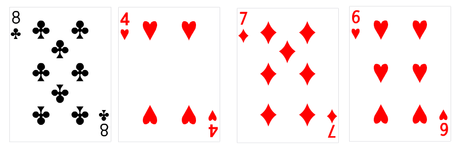

# 变量和类型

前面讲的 "Hello, world!" 程序除了打印一行不能变的字符串，似乎没有什么实用性。为了让我们的程序能执行更复杂的任务，我们需要学习变量的相关概念。

举一个简单的例子来进入主题。现在需要你记住下面四个数字，分别是8、4、7、6，再对这些数字进行简单的四则运算，使得结果等于24。<br>


假设我们用某种方法得知了一种计算过程：8减去7的结果乘以4再乘以6，即`(8-7)*4*6`。现在我们用C语言代码将它表达出来。
```c
int a, b, c, d, result;
a = 8;
b = 4;
c = 7;
d = 6;
result = (a - c) * b * d;
```

这是一个非常简单的例子，我们只使用了5个变量，看起来已经非常多了。但对于计算机来说只是小case，它能轻松地存储数以万计的这样的数字，并能对它们进行非常复杂的操作。

我们现在可以简单地将变量定义为一块内存区域，存储了某一个值。变量需要一个名称，用以区分不同的变量，比如前面的`a`, `result`都是变量名。

## 变量名
一个合法的变量名是由字母、数字和下划线(`_`)组成的。其他的字符，比如空格、各种标点符号都是不允许出现在变量名中的。

变量名必须以字母或下划线开头（不能以数字开头，可以将下划线当作字母）。

下划线通常用于名称较长的变量名，增加代码可读性。另外，尽管变量名可以以下划线开头，但这样的变量名被认为是保留的，比如C语言标准库函数的内部实现，所以不要用下划线开头命名变量。

**C语言对大小写敏感，比如大写的`RESULT`和小写的`Result`是不同的变量，这一点一定要注意。**

变量名不能和C语言关键词相同，C语言关键词有（见[C 关键词](https://zh.cppreference.com/w/c/keyword)）：

<table>
  <tr>
    <td>auto</td>
    <td>extern</td>
    <td>short</td>
    <td>while</td>
  </tr>
  <tr>
    <td>break</td>
    <td>float</td>
    <td>signed</td>
    <td>_Alignas (C11 起)</td>
  </tr>
  <tr>
    <td>case</td>
    <td>for</td>
    <td>sizeof</td>
    <td>_Alignof (C11 起)</td>
  </tr>
  <tr>
    <td>char</td>
    <td>goto</td>
    <td>static</td>
    <td>_Atomic (C11 起)</td>
  </tr>
  <tr>
    <td>const</td>
    <td>if</td>
    <td>struct</td>
    <td>_Bool (C99 起)</td>
  </tr>
  <tr>
    <td>continue</td>
    <td>inline (C99 起)</td>
    <td>switch</td>
    <td>_Complex (C99 起)</td>
  </tr>
  <tr>
    <td>default</td>
    <td>int</td>
    <td>typedef</td>
    <td>_Generic (C11 起)</td>
  </tr>
  <tr>
    <td>do</td>
    <td>long</td>
    <td>union</td>
    <td>_Imaginary (C99 起)</td>
  </tr>
  <tr>
    <td>double</td>
    <td>register</td>
    <td>unsigned</td>
    <td>_Noreturn (C11 起)</td>
  </tr>
  <tr>
    <td>else</td>
    <td>restrict (C99 起)</td>
    <td>void</td>
    <td>_Static_assert (C11 起)</td>
  </tr>
  <tr>
    <td>enum</td>
    <td>return</td>
    <td>volatile</td>
    <td>_Thread_local (C11 起)</td>
  </tr>
</table>

上面表格中以下划线开头的关键词有更好记的名字（宏定义），也不能用于变量名：

| 关键词                  | 用作                         | 定义于        |
|-------------------------|------------------------------|---------------|
| _Alignas (C11 起)       | alignas                      | stdalign.h    |
| _Alignof (C11 起)       | alignof                      | stdalign.h    |
| _Atomic (C11 起)        | atomic_bool. atomic_int, ... | stdatomic.h   |
| _Bool (C99 起)          | bool                         | stdbool.h     |
| _Complex (C99 起)       | complex                      | complex.h     |
| _Generic (C11 起)       | （无宏）                     |               |
| _Imaginary (C99 起)     | imaginary                    | complex.h     |
| _Noreturn (C11 起)      | noreturn                     | stdnoreturn.h |
| _Static_assert (C11 起) | static_assert                | assert.h      |
| _Thread_local (C11 起)  | thread_local                 | threads.h     |

## 基本数据类型
//TODO

## 变量声明和初始化
//TODO

